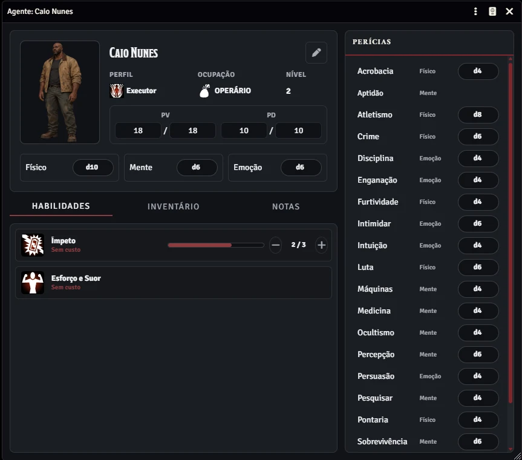
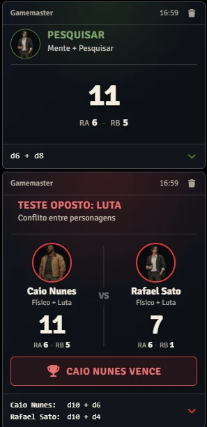
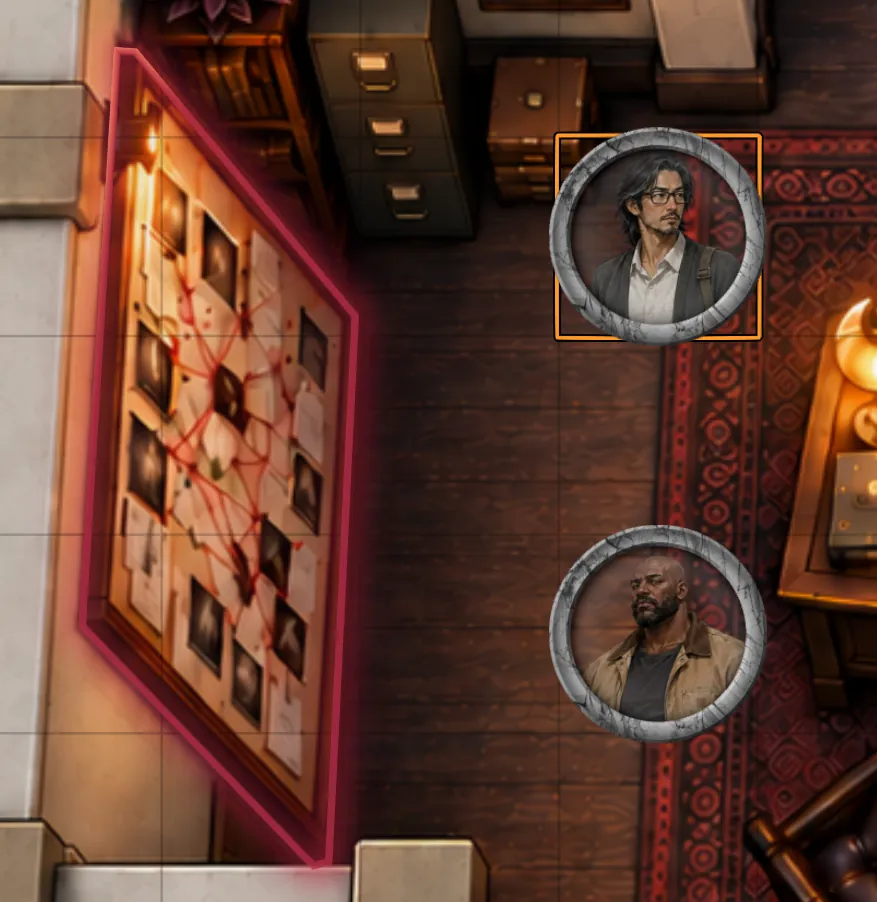

<h1 align="center">Ordem Paranormal 2 para Foundry VTT</h1>

<p align="center">
  <strong>Jogue as regras públicas de playtest de Ordem Paranormal RPG 2 em uma experiência feita para Foundry VTT v14.</strong>
</p>

<div align="center">
  <picture>
    <source media="(prefers-color-scheme: dark)" srcset="assets/branding/community-license-seal-white.png">
    <source media="(prefers-color-scheme: light)" srcset="assets/branding/community-license-seal-black.png">
    
  </picture>
  <p><strong>Contém material gerado por inteligência artificial</strong></p>
  <p><strong>Sistema comunitário não oficial, publicado sob a Licença da Comunidade de Ordem Paranormal.</strong></p>
</div>

<p align="center">
  Ficha de Agente, Check Engine, ferramentas de Mestre com Testes Opostos e Request de Perícias, investigação em cena, Perfis, Habilidades, Ocupações e Equipamentos.
</p>

<p align="center">
  <a href="https://foundryvtt.com/packages/ordemparanormal2"><strong>Instalar pelo Foundry</strong></a>
  ·
  <a href="https://github.com/antoniohbmonteiro/ordemparanormal2/releases/latest"><strong>Última release</strong></a>
  ·
  <a href="https://discord.gg/9pRx2TpvH"><strong>Discord</strong></a>
  ·
  <a href="https://github.com/antoniohbmonteiro/ordemparanormal2/issues"><strong>Reportar problema</strong></a>
  ·
  <a href="CHANGELOG.md"><strong>Changelog</strong></a>
</p>

<p align="center">
  <a href="https://foundryvtt.com/packages/ordemparanormal2">
    
  </a>
  <a href="https://github.com/antoniohbmonteiro/ordemparanormal2/releases/latest">
    
  </a>
</p>

---

> ### Foundry VTT v14-first
>
> **Desenvolvido nativamente para Foundry VTT v14**, aproveitando as APIs públicas atuais da plataforma e a interface do próprio Foundry.

<p align="center">
  
</p>

## O que já funciona

- 🎭 **Ficha de Agente completa** — Perfil, Ocupação, PV/PD, atributos, Perícias, Aptidão, Habilidades e Inventário em uma única ficha.
- 🎲 **Sistema de Testes** — DT opcional, RA/RB, críticos, falha crítica, atributo alternativo, dados situacionais e histórico persistente no chat.
- ⚔️ **Testes Opostos** — cada personagem realiza seu próprio teste, com resultado consolidado em um único card e controle por ownership.
- 🧭 **Ferramentas do Mestre** — acesso rápido a Testes Opostos e Request de Perícias.
- 🔎 **Investigação em cena** — Pontos de Interesse integrados a Regions, destaque no canvas, informações distintas para jogador e Mestre e revelação persistente de pistas.
- 🧩 **Conteúdo reutilizável** — Perfis, Habilidades, Ocupações e Equipamentos como Items integrados à ficha e aos compêndios.
- 🎬 **Cena Narrativa** — mantém o contexto atual da sessão visível para todos os jogadores.
- ⚙️ **Foundry VTT v14-first** — desenvolvido sobre as APIs atuais da plataforma, com integração opcional ao Dice So Nice.

## Feito para jogar, sem disputar espaço com a interface

A ficha concentra o que importa durante a sessão: **Perfil, Ocupação, PV, PD, atributos, Perícias, Habilidades e Inventário**. O sistema acompanha o playtest sem automatizar regras que ainda não estejam confirmadas publicamente.

### Checks que mostram o que aconteceu

Checks de atributo e Perícia usam a progressão **d4 → d6 → d8 → d10 → d12**, com DT opcional, RA/RB, críticos, falha crítica, atributo alternativo e dados situacionais.

Os **Testes Opostos** usam o mesmo Check Engine, podem ser iniciados pela paleta de ferramentas do Mestre e preservam o confronto resolvido em uma única mensagem de chat.

O Mestre também pode criar um **Request de Perícias** para um Agent, com DT opcional, e o jogador autorizado resolve o pedido pelo Check normal no mesmo card.

<p align="center">
  
</p>

### Investigação acontece na própria cena

Pontos de Interesse podem ser associados a **Regions do Foundry**, destacados diretamente no canvas e investigados por jogadores e Mestre em interfaces adequadas a cada papel.

Perícias, DTs públicas ou ocultas e pistas reveladas ficam conectadas aos Pontos de Interesse, mantendo o contexto da investigação na cena.

<p align="center">
  
</p>

## Instalação

### Pelo Foundry VTT

Procure por **Ordem Paranormal 2** no diretório de sistemas do Foundry VTT.

### Pelo manifest

No instalador de sistemas, use:

```text
https://github.com/antoniohbmonteiro/ordemparanormal2/releases/latest/download/system.json
```

### Manualmente

Extraia o pacote da release para:

```text
{Foundry User Data}/Data/systems/ordemparanormal2/
```

## Status do projeto

**Pré-1.0 · desenvolvimento ativo · Foundry VTT v14**

O sistema acompanha um RPG em playtest. Mecânicas e modelos são automatizados somente quando existe uma regra pública suficientemente confirmada.

Durante a fase pré-1.0, o projeto usa SemVer `MAJOR.MINOR.PATCH` na forma `0.X.Y`:

- `0.X.0` — marco funcional relevante;
- `0.X.Y` — manutenção, correções, UX, polimento e melhorias incrementais.

O branch `main` pode conter trabalho ainda não incluído na release pública mais recente.

## Documentação

- [Arquitetura](docs/ARCHITECTURE.md)
- [Modelo de domínio](docs/DOMAIN_MODEL.md)
- [Roadmap](docs/ROADMAP.md)
- [Changelog](CHANGELOG.md)
- [Como contribuir](CONTRIBUTING.md)

## Desenvolvimento

Requer Node.js `24.14.1` ou mais recente.

```bash
npm ci
npm run check
```

Stack principal: **TypeScript · Vite · ES Modules · TypeDataModel · ApplicationV2 · Vitest · Foundry VTT v14+**

---

## Licença, conteúdo não oficial e atribuições

**Este é um conteúdo não oficial, publicado sob a Licença da Comunidade de Ordem Paranormal.**

<picture>
  <source media="(prefers-color-scheme: dark)" srcset="assets/branding/community-license-seal-white.png">
  <source media="(prefers-color-scheme: light)" srcset="assets/branding/community-license-seal-black.png">
  
</picture>

**Contém material gerado por inteligência artificial.**

O uso de conteúdo relacionado a **Ordem Paranormal** neste projeto segue a [Licença da Comunidade de Ordem Paranormal](https://ordemparanormal.com.br/licenca). Consulte também o resumo em [COMMUNITY_LICENSE.md](COMMUNITY_LICENSE.md); o texto oficial da licença prevalece sobre esse resumo.

O código-fonte original do branch de desenvolvimento, a partir da migração do LICENSE, é disponibilizado sob a **[PolyForm Strict License 1.0.0](LICENSE)**. O projeto é **source-available**: o código pode ser consultado e utilizado nos termos dessa licença, mas ela não concede uma permissão geral para redistribuir o sistema ou publicar trabalhos derivados.

As releases públicas até **v0.0.22** foram distribuídas sob MIT, que continua aplicável às cópias já distribuídas. A **v0.1.0 é a primeira release pública distribuída sob PolyForm Strict**.

Contribuições ao repositório oficial são bem-vindas e seguem uma permissão adicional limitada para preparação de pull requests, descrita em [CONTRIBUTING.md](CONTRIBUTING.md), além do [Contributor License Agreement](CLA.md).

O titular do código original é **Antonio Henrique Braga Monteiro**. O titular pode conceder licenças separadas sobre o código que controla, inclusive licenças comerciais ou específicas para parceiros.

A licença do código não concede direitos sobre marcas, selos, artes, mapas, textos, personagens, identidade visual ou qualquer outra propriedade intelectual de terceiros.

Os glyphs usados nos ícones de Habilidades e Perfis são distribuídos pelo Game-icons.net sob CC BY 3.0. Consulte [THIRD_PARTY_LICENSES.md](THIRD_PARTY_LICENSES.md) para atribuições, autores, fontes e licenças aplicáveis.

Este é um projeto comunitário não oficial e não é afiliado, patrocinado ou endossado pelos responsáveis por Ordem Paranormal, salvo se uma autorização ou parceria vier a ser expressamente informada no futuro.

**Ordem Paranormal**, seus nomes, identidade visual, textos, artes e demais propriedades relacionadas pertencem aos seus respectivos detentores de direitos.

Este repositório não distribui textos, artes, personagens ou outros conteúdos protegidos do jogo além do que seja permitido pela Licença da Comunidade ou por autorização específica aplicável.
